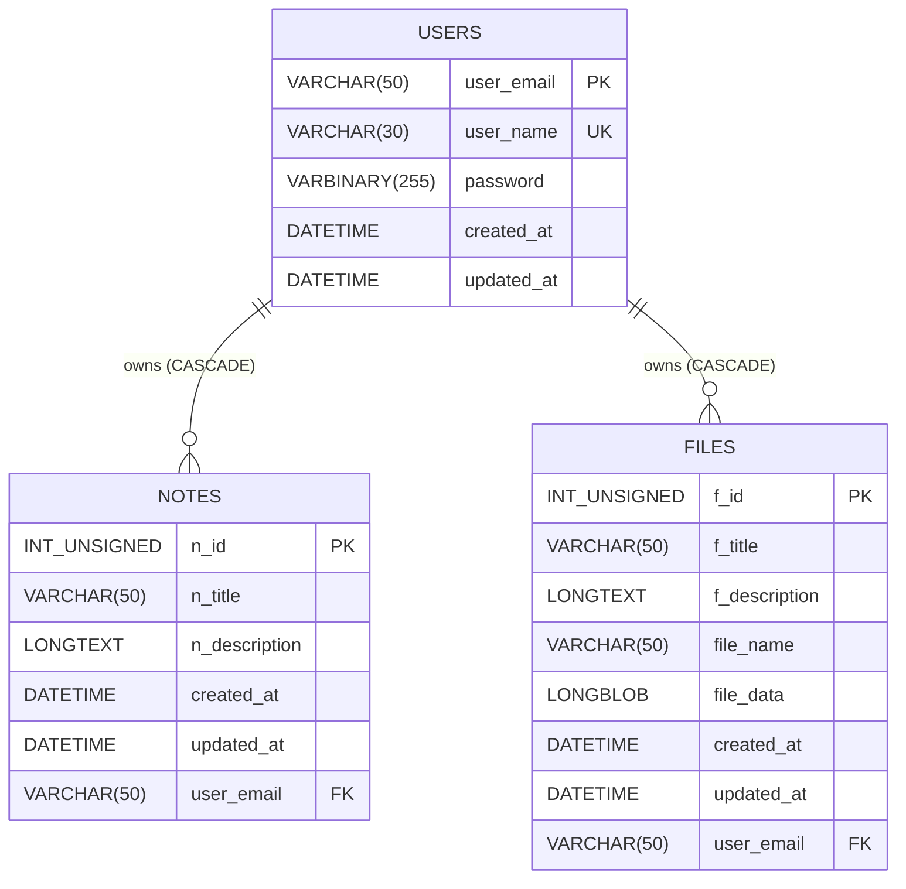

# QuickNotes: A Secure Web-Based Notes and File Management Application

[](https://flask.palletsprojects.com/)
[](https://www.mysql.com/)
[](https://www.python.org/)
[](LICENSE)

A secure, high-performance, and fully responsive web application for note-taking and file management, built with Flask and MySQL. QuickNotes features comprehensive user authentication, OTP verification via email, and dynamic, encrypted data handling.

---

## 🚀 Live Demo

**Production Deployment:** [http://98.80.74.218/](http://98.80.74.218/)

*Hosted on AWS EC2 behind an Nginx reverse proxy with Gunicorn.*

---

## 📋 Table of Contents

1. [Features & Capabilities](#-features--capabilities)
2. [Project Tech Stack](#-project-tech-stack)
3. [Architecture & Folder Structure](#-architecture--folder-structure)
4. [File Walkthrough & Component Roles](#-file-walkthrough--component-roles)
5. [Database Design & Schema](#-database-design--schema)
6. [End-to-End Application Workflows](#-end-to-end-application-workflows)
7. [Installation & Configuration (Local Development)](#-installation--configuration-local-development)
8. [Production Deployment Guide (AWS EC2 & Nginx)](#-production-deployment-guide-aws-ec2--nginx)
9. [Troubleshooting & FAQs](#-troubleshooting--faqs)
10. [Testing & Verification Checklist](#-testing--verification-checklist)
11. [Author & Contact Info](#-author--contact-info)

---

## ✨ Features & Capabilities

### 🔐 Authentication & Security
- **Secure Registration:** Users sign up with username, email, and password. Details are stored in temporary sessions during verification.
- **OTP Verification (Gmail SMTP):** Uses a 6-character, high-entropy OTP for account activation, sent directly to the user's email.
- **1-Minute Countdown Timer:** Displays on all OTP screens (`otp.html` and `change_password_otp.html`) to visually notify users when their code expires.
- **Password Hashing:** Implemented with `bcrypt`, generating secure, salted binary hashes stored in the database.
- **Password Recovery & Timed Links:** "Forgot Password" sends a timed token link generated using `itsdangerous` with an automatic 1-hour expiration limit.
- **Profile Password Operations:** Allows password updates via current password validation, using a secondary OTP confirmation flow for elevated safety.
- **Session Security:** Backed by filesystem-based sessions (`Flask-Session`) stored server-side to prevent client-side cookie tampering.

### 📝 Notes Management
- **Full CRUD Support:** Users can create, view, edit, search, and delete personal notes.
- **Jinja2 HTML Rendering:** Notes support safe rendering of rich text.
- **Note Download:** Exports notes as clean, formatted `.txt` files directly via browser download.
- **Quick-Add Button:** Includes direct shortcuts to create a note from the "View All Notes" page.
- **Destructive Safety Operations:** Supports a "Delete All Notes" button, highlighted in a custom soft red color (`#ff7675`) to prevent accidental clicks.

### 📁 File Management
- **Direct Database Storage:** Uploaded files are converted into binary streams and stored directly as `LONGBLOB` data in MySQL. Supports files up to 4GB.
- **Metadata Management:** Users can supply a custom title and long-form description for every file uploaded.
- **Dynamic File Downloads:** Utilizes Flask's `send_file` with an `io.BytesIO` wrapper to stream file binary content back to the client dynamically.
- **Search Capabilities:** Fast database search allows filtering through file names, titles, and descriptions.
- **Quick-Upload Button:** Includes direct shortcuts to upload a file from the "View All Files" page.
- **Bulk Operations:** Users can clear out all uploaded files with a specialized, red-styled bulk delete button.

### 👤 Profile & Dashboard
- **Statistics Widget:** Displays note and file count metrics dynamically using optimized SQL counting queries.
- **Profile Updating:** Allows users to modify their username and registered email.
- **Cascading Account Deletion:** Permits users to delete their account. This automatically deletes all associated notes and files at the database level via relational constraint cascades.

---

## 🛠 Project Tech Stack

### Backend
- **Flask (v2.3.3):** Web framework running core server routing and controller functions.
- **Flask-Session (v0.5.0):** Drives server-side session persistence.
- **Flask-Excel (v0.0.7):** Extends spreadsheet export integrations.
- **mysql-connector-python (v8.0.33):** Primary driver for execution of database transactions.
- **bcrypt (v4.0.1):** Hashing function utilized for password cryptographic processing.
- **itsdangerous (v2.1.2):** Used for timed serializer URL tokens.
- **python-dotenv (v1.0.0):** Loads local configurations into system environment variables.

### Frontend
- **HTML5 & Vanilla JS:** Handles structured layout and interactive timers.
- **CSS3 (Custom Stylesheet):** Modern visual aesthetics featuring glassmorphism cards, responsive grids, and highlight animations.
- **Bootstrap 5 (CDN):** Responsive grid structures and layout framework utilities.

### Infrastructure
- **Ubuntu 20.04/22.04 LTS (AWS EC2):** Production OS environment.
- **Nginx:** High-performance web server acting as a reverse proxy.
- **Gunicorn (v20.1.0):** WSGI HTTP server binding to local Unix sockets to handle concurrent requests.

---

## 🏗 Architecture & Folder Structure

QuickNotes runs on a standard Model-View-Controller style architecture, utilizing Flask routing, templates for presentation, and MySQL as a persistent database store.

```
┌─────────────────┐      ┌─────────────────────┐      ┌──────────────────┐
│   Web Browser   │ ───> │  Nginx (Port 80)    │ ───> │ Gunicorn Socket  │
│                 │ <─── │  (Reverse Proxy)   │ <─── │ (/run/socket)    │
└─────────────────┘      └─────────────────────┘      └──────────────────┘
                                                               │
                                                               ▼
┌─────────────────┐      ┌─────────────────────┐      ┌──────────────────┐
│ MySQL Database  │ <─── │   Flask App         │ <─── │    WSGI Entry    │
│ (Tables Schema) │ ───> │   (app.py logic)    │ ───> │    (app:app)     │
└─────────────────┘      └─────────────────────┘      └──────────────────┘
                                   │
                                   ▼
                         ┌─────────────────────┐
                         │   File System       │
                         │                     │
                         │ - Flask Session DB  │
                         └─────────────────────┘
```

### Folder Directory Map
```
quicknotes/
├── .env                  # Local environment file (ignored by Git)
├── .env.example          # Template for required environment variables
├── .gitignore            # Git exclusion rules
├── app.py                # Main application code & routing controls
├── cmail.py              # Email helper wrapper (Gmail SMTP / Console Simulation)
├── otp.py                # OTP generation logic using python secrets
├── secret_token.py       # Serializer utility for timed URL tokens
├── secretkeys.py         # Config module parsing global environment tokens
├── requirements.txt      # List of dependencies
├── data.sql              # Clean MySQL database schema dump
├── static/               # Static assets
│   ├── css/
│   │   └── style.css     # Core application visual layout styles
│   └── images/
│       └── avatar.png    # Default profile picture fallback
└── templates/            # Jinja2 HTML layout components
    ├── index.html
    ├── register.html
    ├── otp.html
    ├── login.html
    ├── forgotpassword.html
    ├── resetpassword.html
    ├── dashboard.html
    ├── addnote.html
    ├── addfile.html
    ├── viewallnotes.html
    ├── viewallfiles.html
    ├── viewnote.html
    ├── viewfile.html
    ├── change_password_otp.html
    └── profile.html
```

---

## 📂 File Walkthrough & Component Roles

### Core Application Scripts

#### 1. [app.py](file:///c:/Users/ADMIN/Desktop/quicknotes/app.py)
The primary driver of the application. It handles:
- Initialization of Flask configs (sessions, database connections, and environment states).
- Context-based SQL connections via MySQL cursor pools.
- Authentication paths (`/register`, `/sendotp`, `/login`, `/logout`).
- User settings management (updating profile data, deleting accounts, password change verification).
- Content CRUD logic: Note additions/modifications, file reading, file binary writing, and file deletion.
- Search queries that scan note descriptions and file metadata matches.

#### 2. [cmail.py](file:///c:/Users/ADMIN/Desktop/quicknotes/cmail.py)
Handles communication with SMTP servers.
- **Gmail SMTP Integration:** Connects to `smtp.gmail.com` using SSL on Port 465.
- **Simulated Development Mode:** If `EMAIL_USER` or `EMAIL_PASS` variables are missing from environment variables, the script catches this and shifts into a safe fallback mode. Instead of raising a connection error, it prints the simulated email headers and body (including raw OTP codes and recovery URLs) directly to the system console stdout. A system notification warning is shown to developers indicating that email simulation mode is active.

#### 3. [otp.py](file:///c:/Users/ADMIN/Desktop/quicknotes/otp.py)
Generates high-entropy OTP codes.
- Relies on Python's cryptographically secure `secrets` library instead of `random`.
- Construct: Generates a 6-character alphanumeric code consisting of alternating uppercase characters, lowercase characters, and random numeric digits (e.g. `Xy4Wz8`).

#### 4. [secret_token.py](file:///c:/Users/ADMIN/Desktop/quicknotes/secret_token.py)
Provides secure link serialization.
- Leverages `itsdangerous.URLSafeTimedSerializer` with a customized secret key and salt.
- Encrypts target data (such as emails) into URL-safe strings used for password recovery paths.
- Safely decrypts strings while enforcing expiry checks (`loads(token, salt, max_age)`), raising `SignatureExpired` if the age exceeds configured limit (typically 1 hour) or `BadSignature` if the token has been altered.

#### 5. [secretkeys.py](file:///c:/Users/ADMIN/Desktop/quicknotes/secretkeys.py)
Exposes configuration keys, mapping them to system environment values or providing runtime fallback defaults.

---

## 🗄️ Database Design & Schema

QuickNotes relies on a three-table MySQL database structure. Relationships are fully constrained with cascading rules ensuring clean data deletion.



### Table Schema Definition Breakdown

#### 1. Users Table (`users`)
Stores profile information and credentials.
- **Key details:** `user_email` is the primary key. `password` is stored as `VARBINARY(255)` because bcrypt hashes are binary data and should be saved byte-for-byte to prevent character encoding issues.

| Field | Type | Null | Key | Default | Extra / Trigger |
| :--- | :--- | :--- | :---: | :--- | :--- |
| **user_email** | VARCHAR(50) | NO | PRI | NULL | |
| **user_name** | VARCHAR(30) | NO | UNI | NULL | |
| **password** | VARBINARY(255) | YES | | NULL | |
| **created_at** | DATETIME | YES | | CURRENT_TIMESTAMP | |
| **updated_at** | DATETIME | YES | | CURRENT_TIMESTAMP | ON UPDATE CURRENT_TIMESTAMP |

#### 2. Notes Table (`notes`)
Stores text notes created by the users.
- **Key details:** Linked to `users` using a foreign key constraint on `user_email` with `ON DELETE CASCADE`.

| Field | Type | Null | Key | Default | Extra / Trigger |
| :--- | :--- | :--- | :---: | :--- | :--- |
| **n_id** | INT UNSIGNED | NO | PRI | NULL | AUTO_INCREMENT |
| **n_title** | VARCHAR(50) | NO | | NULL | |
| **n_description** | LONGTEXT | NO | | NULL | |
| **created_at** | DATETIME | YES | | CURRENT_TIMESTAMP | |
| **updated_at** | DATETIME | YES | | CURRENT_TIMESTAMP | ON UPDATE CURRENT_TIMESTAMP |
| **user_email** | VARCHAR(50) | YES | MUL | NULL | Foreign Key |

#### 3. Files Table (`files`)
Stores uploaded binary files.
- **Key details:** The actual file contents are stored as a `LONGBLOB` inside `file_data`. A unique key constraint `unique_file_user` is enforced on `(user_email, file_name)` to prevent a single user from uploading multiple files with the same name.

| Field | Type | Null | Key | Default | Extra / Trigger |
| :--- | :--- | :--- | :---: | :--- | :--- |
| **f_id** | INT UNSIGNED | NO | PRI | NULL | AUTO_INCREMENT |
| **f_title** | VARCHAR(50) | YES | | NULL | |
| **f_description** | LONGTEXT | YES | | NULL | |
| **file_name** | VARCHAR(50) | YES | | NULL | |
| **file_data** | LONGBLOB | YES | | NULL | |
| **created_at** | DATETIME | YES | | CURRENT_TIMESTAMP | |
| **updated_at** | DATETIME | YES | | CURRENT_TIMESTAMP | ON UPDATE CURRENT_TIMESTAMP |
| **user_email** | VARCHAR(50) | YES | MUL | NULL | Foreign Key |

---

## 🔄 End-to-End Application Workflows

### 1. User Onboarding (Registration & Activation)
```
[User Form Submit] ──> Hash Password (bcrypt) ──> Store in session['regdata']
                                                        │
                                                        ▼
                                                 Generate 6-Char OTP
                                                        │
                                                        ▼
[Verify OTP Screen] <── Redirection ── Send OTP via Email (or Console Log)
        │
        ├─> Correct OTP entered ──> Write user row to DB ──> Redirect Login
        └─> Timeout / Wrong OTP ──> Denied / Require resend request
```

### 2. Password Reset Workflow
1. **Request Reset:** User submits their registered email at `/forgotpassword`.
2. **Link Generation:** The application verifies email existence in the `users` table. If found, it invokes `secret_token.endata(user_email)` to generate a timed, signed string.
3. **Transmission:** A link pointing to `http://<domain>/resetpassword/<token>` is emailed to the user.
4. **Validation:** Clicking the link invokes `/resetpassword/<token>`. The system checks:
   - Integrity of token signature (ensuring it was not tampered with).
   - Expiration age (must be within 1 hour).
5. **Modification:** If checks pass, the page displays a secure input form to set a new password, hashing it using `bcrypt` before storing it in the database.

### 3. File Upload and Storage Mechanics
1. **Transmission:** The user selects a file, inputs a title/description, and submits the form at `/addfile`.
2. **Binary Read:** In Flask, the file object's contents are read dynamically using `file.read()`.
3. **SQL Insertion:** The query executes:
   ```sql
   INSERT INTO files (f_title, f_description, file_name, file_data, user_email) 
   VALUES (%s, %s, %s, %s, %s)
   ```
   The binary array is stored directly in the `file_data` `LONGBLOB` field.

### 4. File Download & Rendering Mechanics
1. **Dynamic Streaming:** When `/download_file/<fid>` is invoked, the database fetches the row containing matching metadata and `file_data`.
2. **In-Memory Buffering:** The binary content is loaded into a virtual file wrapper using Python's `io.BytesIO(file_data)`.
3. **MIME Mapping:** Python's standard libraries or Flask settings match the file name extension to its respective MIME format.
4. **Client Output:** Flask sends the file stream using:
   ```python
   return send_file(BytesIO(file_data), download_name=file_name, as_attachment=True)
   ```

---

## ⚙️ Installation & Configuration (Local Development)

### Prerequisites
- Python 3.8 or higher.
- MySQL Server 8.0+.
- Git.

### 1. Clone the Codebase
```bash
git clone https://github.com/chintadavasudharini/quicknotes.git
cd quicknotes
```

### 2. Establish python Virtual Environment
```bash
# Windows
python -m venv venv
venv\Scripts\activate

# Linux/macOS
python3 -m venv venv
source venv/bin/activate
```

### 3. Install Dependencies
```bash
pip install -r requirements.txt
```

### 4. Setup Local MySQL Database
1. Connect to your MySQL shell:
   ```bash
   mysql -u root -p
   ```
2. Create the database and import `data.sql`:
   ```sql
   CREATE DATABASE quicknotes;
   USE quicknotes;
   SOURCE /path/to/quicknotes/data.sql;
   ```
   *Note: If you do not have `data.sql` at hand, copy-paste the schema tables structure from the **Database Design & Schema** section above directly into your MySQL command prompt.*

### 5. Configure Environment Variables
Create a file named `.env` in the root of the project:
```env
# Flask Settings
SECRET_KEY=generate_your_secret_key_here
SALT=generate_your_salt_here

# Database Configuration
DB_HOST=localhost
DB_USER=your_mysql_username
DB_PASSWORD=your_mysql_password
DB_NAME=quicknotes

# Email SMTP Settings (Gmail)
# 1. Enable 2-Step Verification on your Gmail account.
# 2. Go to Security -> App Passwords and generate a password.
EMAIL_USER=your_email@gmail.com
EMAIL_PASS=your_gmail_app_password
```

### 6. Run the Development Server
```bash
python app.py
```
Open your web browser and navigate to `http://127.0.0.1:5000/`.

---

## 🚀 Production Deployment Guide (AWS EC2 & Nginx)

This guide documents deploying the QuickNotes Flask application onto an AWS EC2 instance running Ubuntu Linux.

### 1. Provision Server Dependencies
Access the server terminal (e.g., via AWS Instance Connect or SSH) and install required software packages:
```bash
sudo apt update
sudo apt install python3 python3-pip python3-venv mysql-server nginx git -y
```

### 2. Configure the MySQL Database
If using a local MySQL instance on the server, secure it and run setup commands:
```bash
sudo mysql_secure_installation
sudo mysql
```
```sql
CREATE DATABASE quicknotes;
CREATE USER 'quicknotes_user'@'localhost' IDENTIFIED BY 'secure_password';
GRANT ALL PRIVILEGES ON quicknotes.* TO 'quicknotes_user'@'localhost';
FLUSH PRIVILEGES;
EXIT;
```
Import the schema:
```bash
mysql -u quicknotes_user -p quicknotes < /home/ubuntu/quicknotes/data.sql
```

### 3. Deploy the Project Files
Clone your repository into the target directory, set up dependencies, and verify directory permissions:
```bash
sudo git clone https://github.com/chintadavasudharini/quicknotes.git /home/ubuntu/quicknotes
cd /home/ubuntu/quicknotes

# Setup Virtual Environment
python3 -m venv venv
source venv/bin/activate
pip install -r requirements.txt

# Set permissions (ensure Gunicorn/nginx can access files)
sudo chown -R ubuntu:www-data /home/ubuntu/quicknotes
```
Create the production `.env` file inside `/home/ubuntu/quicknotes` matching your production MySQL credentials.

### 4. Create Gunicorn systemd Service
Configure Gunicorn to run in the background as a system service. Create the service definition file:
```bash
sudo nano /etc/systemd/system/quicknotes.service
```
Paste the following configurations:
```ini
[Unit]
Description=Gunicorn instance to serve QuickNotes Flask Application
After=network.target

[Service]
User=ubuntu
Group=www-data
WorkingDirectory=/home/ubuntu/quicknotes
Environment="PATH=/home/ubuntu/quicknotes/venv/bin"
ExecStart=/home/ubuntu/quicknotes/venv/bin/gunicorn --workers 3 --bind unix:/home/ubuntu/quicknotes/quicknotes.sock app:app

[Install]
WantedBy=multi-user.target
```
Enable and start the service:
```bash
sudo systemctl daemon-reload
sudo systemctl start quicknotes.service
sudo systemctl enable quicknotes.service
```

### 5. Configure Nginx as a Reverse Proxy
Create a custom Nginx server block to handle incoming HTTP requests and redirect them to the Gunicorn socket:
```bash
sudo nano /etc/nginx/sites-available/quicknotes
```
Paste the configuration:
```nginx
server {
    listen 80;
    server_name 98.80.74.218;

    # Increase maximum upload file limit to 50MB (default is 1MB)
    client_max_body_size 50M;

    location / {
        include proxy_params;
        proxy_pass http://unix:/home/ubuntu/quicknotes/quicknotes.sock;
    }

    # Location for static assets (optional caching optimization)
    location /static/ {
        alias /home/ubuntu/quicknotes/static/;
    }
}
```
Enable the site block and restart Nginx:
```bash
sudo ln -s /etc/nginx/sites-available/quicknotes /etc/nginx/sites-enabled/
# Remove default Nginx welcome page to prevent conflicts
sudo rm /etc/nginx/sites-enabled/default
sudo nginx -t
sudo systemctl restart nginx
```

---

## 🔧 Troubleshooting & FAQs

### Q1: I encounter `KeyError: 'COUNT(*)'` or `'count(*)'` on the Profile Page. How was this fixed?
* **Cause:** Dict-based cursors returned by database adapters (such as `mysql-connector-python`) map columns using MySQL driver cases. Local development environments on Windows and Linux databases can resolve cursors with different casings depending on SQL engine configurations.
* **Fix:** Avoid referencing plain `COUNT(*)` keys in Python code. Instead, write explicit aliases in SQL queries and access that alias:
  ```sql
  -- Avoid:
  SELECT COUNT(*) FROM notes WHERE user_email=%s;
  -- Prefer:
  SELECT COUNT(*) AS cnt FROM notes WHERE user_email=%s;
  ```
  In Python: `notes_count = row['cnt']`.

### Q2: I'm not receiving OTP emails. How do I configure SMTP?
* **Cause:** Standard Gmail SMTP requires enabling 2-step verification and generating a specialized App Password. Your personal account password will be rejected.
* **Solution:**
  1. Go to Google Account Settings -> Security.
  2. Turn on **2-Step Verification**.
  3. Search or navigate to **App Passwords**.
  4. Generate a new password under "Other" (e.g. name it "QuickNotes").
  5. Copy the 16-character code generated and paste it into `EMAIL_PASS` in your `.env` configuration.

### Q3: When uploading large files, Nginx returns a "413 Payload Too Large" error. How do I fix it?
* **Cause:** By default, Nginx limits client body request transfers to 1MB.
* **Fix:** Update your Nginx server block configuration file (`/etc/nginx/sites-available/quicknotes`) by adding `client_max_body_size 50M;` inside the `server` block. Restart Nginx via:
  ```bash
  sudo systemctl restart nginx
  ```

### Q4: I need to upgrade an existing database schema to the latest version. What SQL scripts should I run?
If your database schema doesn't match the latest updates, run these migrations in your MySQL terminal:
```sql
USE quicknotes;

-- Add updated_at fields
ALTER TABLE notes ADD COLUMN updated_at DATETIME DEFAULT CURRENT_TIMESTAMP ON UPDATE CURRENT_TIMESTAMP;
ALTER TABLE files ADD COLUMN updated_at DATETIME DEFAULT CURRENT_TIMESTAMP ON UPDATE CURRENT_TIMESTAMP;

-- Remove deprecated last_login column
ALTER TABLE users DROP COLUMN last_login;
```

---

## 🧪 Testing & Verification Checklist

### Automated Setup Validation
Ensure the installation was completed successfully and packages are updated:
```bash
python -c "import flask, bcrypt, itsdangerous; print('All key libraries are imported successfully')"
```

### Manual QA Validation Run
- [ ] **Account Onboarding:** Create user -> check OTP arrival (or check logs in simulation dev mode) -> input correct code -> login.
- [ ] **Incorrect OTP handling:** Register -> try to input incorrect OTP -> verify error displays -> check resend button functionality.
- [ ] **OTP Countdown:** Open the OTP submission page -> ensure the timer counts down from 60 seconds.
- [ ] **Notes CRUD:** Create note -> View note -> Edit note -> Verify "Lastly Updated" timestamp displays updated time -> Download note -> Verify downloaded content.
- [ ] **Files Handling:** Upload file with description -> search for the file -> view details -> click download -> confirm download file size and content match the source.
- [ ] **Password Reset:** Submit forget password request -> access the timed email link -> reset password -> login using the new password.
- [ ] **Profile Counters:** Open Profile page -> verify the note count and file count display statistics accurately.
- [ ] **Destructive Cascades:** Delete a user account -> verify the corresponding entries are completely removed from both `notes` and `files` tables.

---

## 👩‍💻 Author & Contact Info

### **Chintada Vasudharini**

**Python Full Stack Developer | AWS | AI-ML**

📍 *KL University | BTech CSE*

- **GitHub:** [@chintadavasudharini](https://github.com/chintadavasudharini)
- **LinkedIn:** [Chintada Vasudharini](https://www.linkedin.com/in/chintada-vasudharini-nov21/)
- **Email:** [chintadavasudharini@gmail.com](mailto:chintadavasudharini@gmail.com)
- **Personal Portfolio:** [Visit Here](https://portfolio-lime-tau-36.vercel.app/)
